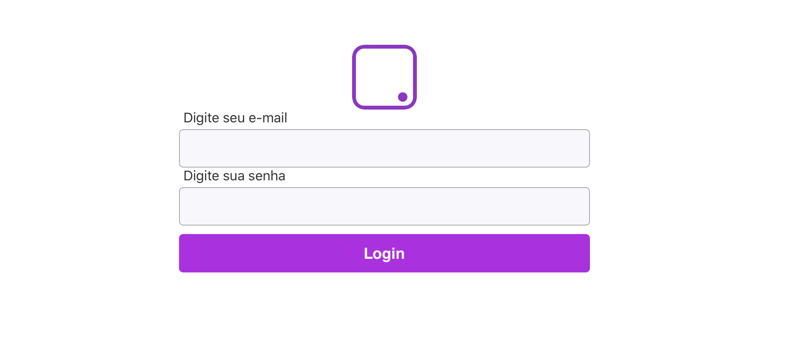

# Phovi - Teste

Na plataforma da phovi existe um game de trivia de V ou F, e estamos implementando um modo de múltipla escolha.

Precisamos que trivias sejam gerados o mais rápido possível, assim, foi passada a tarefa para nosso estagiário criar o <br>
'Trivia Maker' um site para que seja possível ler os trivias de V/F do banco de dados,adaptar para múltipla escolha e <br>
enviar direto no servidor.

O estagiário fez o front, agora a sua missão é fazer o backend da aplicação, primeiramente é necessário conectar a <br>
aplicação com firebase, para isso você precisará criar uma aplicação no firebase e conectar com o front end da aplicação.


## Tasks

- [ ok ] 1) Assim que a aplicação estiver conectada, a versão web deve funcionar normalmente, para poder acessar o <br>
Trivia Maker vai ser necessário criar um usuário e senha no firebase auth, para poder fazer login

- [ ok ] 2) Para carregar os trivias, tem que adicionar um trivia no Firestore, apesar de não ter sido passado a <br>
estrutura da database, é só fazer "engenharia reversa" das requisições

- [ ~ok ] 3) Quando um trivia é adicionado, ele acaba indo com uma url de imagem de sites de terceiros,assim, a imagem <br>
pode cair, ficar fora do ar,ou ter acesso bloqueado. Para evitar isso, uma funcionalidade importante é pegar a <br>
imagem que foi armazenada no Firestore, baixar, comprimir e enviar para o Storage do firebase, e depois substituir <br>
o link que antes era de um site de terceiro, pelo link do Storage, isso pode ser realizado pelo Functions do firebase

- [ ~ok ] 4) Como é importante garantir que os trivias só sejam acessados/alterados por quem está autenticado, é importante <br>
criar regras de segurança no firestore e storage para garantir isso, crie as regras que achar necessário, podendo criar<br>
regras individuais de cada campo

- [ ok ] 5) É interessante armazenar qual foi o último usuário que entrou nessa aplicação web, assim, a cada login na <br>
aplicação web, adicione em uma tabela no Real Time Database do firebase (/adminAccess), o uid do usuário que acessou <br>
e o timestamp, também crie regras dessa tabela


## Steps

- ```npm install``` -> 1 vulnerabilidade encontrada. Usei ```npm audit``` e vi a vulnerabilidade no *react-scripts@4.0.1*.<br>
Em seguida fiz ```npm install react-scripts@4.0.1``` para corrigir isso.

- ```npm start``` -> alguns warnings foram gerados, porém a aplicação começou a funcionar. Mesmo assim a interface web<br>
estava apenas uma página em branco.

- Alguns warnings e erros foram encontrados na página e por isso ela estava em branco. Para corrigir os warnings <br>
precisei alterar alguns pequenos trechos de código. Feito isso, percebi que faltava uma API KEY do Firebase para<br>
a aplicação funcionar.

- Entrei no site do [Firebase](https://firebase.google.com) e criei o projeto "trivia-maker". Dessa forma pude <br>
adicionar ao arquivo de configuração do Firebase nesse projeto (/src/firebase/index.ts) as informações necessárias<br>
para que a aplicação funcionasse, exceto pela "databaseURL", a qual ainda não entendi a função. Com isso a página web<br>
passou a apresentar a tela de login conforme a imagem abaixo :



- ~~Para que eu pudesse criar usuários e senhas no Firebase auth, além de autenticar múltiplas features etc, foi preciso<br>
adicionar o **Firebase Admin SDK** ao Trivia Maker. Para isso tive que modificar novamente o arquivo de configuração<br>
do Firebase com alguns trechos de código.~~

    - ~~Ainda nisso, foi preciso instalar o pacote **firebase-admin** : ```npm install firebase-admin --save```. Assim <br>
    esse pacote já foi salvo no *package.json*.~~

    - ~~Para inicializar o SDK foi preciso adicionar uma chave privada para esse serviço. Tentei Seguir o padrão sugerido na<br>
    [documentação](https://firebase.google.com/docs/admin/setup?authuser=0#initialize-sdk) utilizando variáveis locais, porém acabei utilizando o caminho relativo<br>
    para o arquivo json contendo a chave no próprio código.~~

    - ~~TODO : resolver warnings de compilação~~

    OBS.: Reconsiderei os passos marcados acima e decidi continuar sem eles. Acho que é desnecessário por enquanto.

- Adicionei ao Firebase Auth a opção de log in via email + senha, e criei o primeiro usuário : ```teste@phovi.com```.<br>
**Task 1 -> ok.**

> 20/12/2020

- **Task 4 -> ok, parcialmente, pois é possível criar regras mais elaboradas**

- Executei a aplicação e tentei criar um trivia sobre o Chaves, parecido com o exemplo que me foi passado. Percebi que,<br>
ao clicar em ```Send to Firebase```, ocorre um erro de permissão negada. Isso é provavelmente porque ainda não adicionei<br>
regras de segurança para permitir o usuário autenticado fazer um "set" na nossa database.

    - A partir da constatação acima entrei na Firestore/rules e comecei a criar e testar regras. Criei uma regra inicial <br>
    para permitir acesso de read e de write para todo usuário que já fez log in.

    - ~~Percebi que a funcionalidade ```Load Trivia``` não estava trazendo para o front-end as trivias de teste que eu havia<br>
    adicionado manualmente na Firestore. Vi que era um bug simples no código em ```/src/components/ModalLoadTrivia/index.tsx```<br>
    na linha 24 na chamada da setOpenModal, que deveria ter recebido o valor "true" como parâmetro.~~

    OBS.: na verdade não foi bem isso o que ocorreu, por isso desconsiderei essa parte.

    - ~~Mesmo assim, ao selecionar uma trivia, outro erro era gerado e a aplicação exibia tele de erro. No momento <br>
    estou trabalhando para consertar isso.~~

    - **Task 2 -> ok**

- Adicionei o pacote firebase/databse para que fosse possível conectar o Trivia Maker com o Realtime Database do Firebase.

    - Estou estudando como adicionar o uid e o timestamp para a base de dados quando houver log in.

    > 21/12/2020

    - Mudei a regra de segurança no Realtime DB para permitir read e write somente ao usuário que fez log in.

    - Consegui adicionar o uid e o timestamp (este usando ```Date.now()```) ao Realtime para cada log in na aplicação.<br>
    **Task 5 -> ok**

- Criei uma pasta chamada ```backend-TriviaMaker``` para servir de backend usando Firebase Functions e fiz os passos<br>
iniciais conforme o [video de explicação](https://www.youtube.com/watch?v=DYfP-UIKxH0).

    - As dependências necessárias que nosso front-end usa foram instaladas (storage, database etc) e os arquivos<br>
    com as regras que eu havia criado foram criados. Agora sim temos um back-end pegando robustez.

> 22/12/2020 e 23/12/2020

- Comecei a escrever as funções para atualizar as imagens das Trivias e passei um bom tempo estudando uma estratégia viável<br>
para realizar essa tarefa

> 24/12/2020 - 26/12/2020

- Depois de várias tentativas sem sucesso, pelo visto terei que enviar a imagem para o Storage pelo front-end mesmo.

- Vou tentar seguir o seguinte algoritmo :

    1. No front : baixar a imagem a partir da url fornecida pelo usuário usando o pacote ```Axios```. Após o download,<br>
    mando o arraybuffer para o Storage e salvo com o tipo ```image/jpg```;

    2. No back : Storage trigger -> ao ser adicionada uma nova imagem, um gatilho é acionado para uma cloud function,<br>
    a qual pega o link dessa imagem no Storage, vai na Firestore e atualiza o link da imagem relacionada àquela Trivia.

    OBS.: por enquanto só fiz para a photoUrl, que é a imagem da Trívia. As imagens das perguntas, as image_url, ainda não estão na solução, até pq não sei se é necessário.

    - Alguns problemas encontrados :

        1. O link da Storage para a imagem é de acesso restrito, então uma opção é tentar tornar ele público para que<br> 
        outra aplicação possa usá-lo;

        2. O Axios baixa a imagem no frontend, porém o CORS do navegador passa a negar esse download porque as <br>
        URLs das imagens são de sites terceiros. Passei muito tempo tentando resolver isso, porém ainda não consegui.<br>
        Eu queria fazer o app Trívia Maker usar o node CORS no client-side, aí acho que resolveria o problema.

    - Com isso, **Task 3 -> ok**, parcialmente.